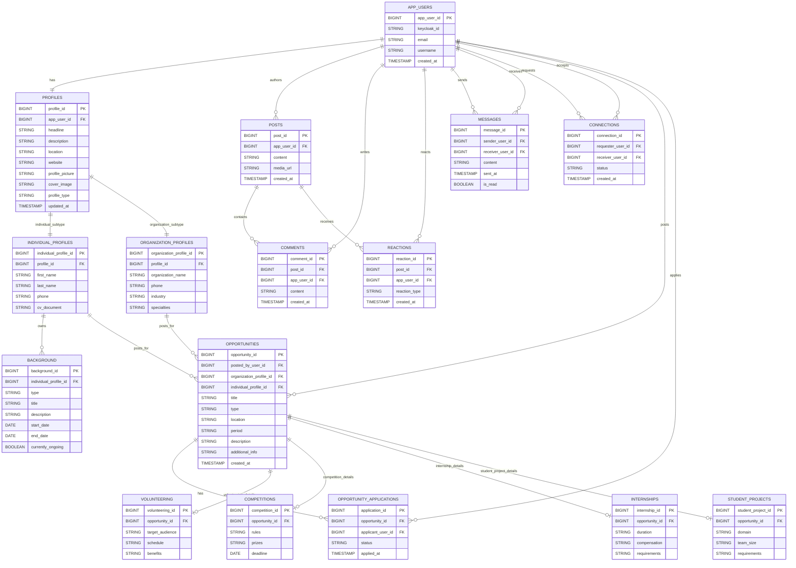

# AgoraCampus

Spring Boot API with PostgreSQL, Keycloak JWT auth, Flyway migrations, and a Next.js frontend.

## Quick Start

If you just want to launch everything locally, run these three steps from the repository root:

1. `docker-compose up -d`
2. `.\scripts\dev-backend.ps1`
3. `cd AgoraCampusFrontEnd && npm.cmd install && npm.cmd run dev`

Open the frontend at `http://localhost:3000` and use the seeded `admin` / `admin` or `demo` / `demo` accounts.

## Requirements

- Java 21
- Maven
- Docker Desktop
- Node.js and npm

On Windows PowerShell, use `npm.cmd` instead of `npm` if script execution policy blocks `npm.ps1`.

## Run The App Locally

Run the backend dependencies, backend API, and frontend in separate terminals.

### 1. Start Postgres And Keycloak

From the repository root:

```powershell
cd C:\path\to\Kronsoft_Project
docker-compose up -d
```

Wait until both containers are healthy:

```powershell
docker-compose ps
```

Default ports:

- PostgreSQL: `localhost:5432`
- Keycloak: `http://localhost:8090`

If you already have a local PostgreSQL running on `5432`, create a local `.env` file at the repository root:

```env
POSTGRES_PORT=5433
POSTGRES_USER=postgres
POSTGRES_PASSWORD=postgres
POSTGRES_DB=agora_campus

KEYCLOAK_PORT=8090
KEYCLOAK_ADMIN=admin
KEYCLOAK_ADMIN_PASSWORD=admin

DB_URL=jdbc:postgresql://127.0.0.1:5433/agora_campus
DB_USERNAME=postgres
DB_PASSWORD=postgres
```

Then restart Docker Compose:

```powershell
docker-compose down
docker-compose up -d
```

`.env` is local-only and must not be committed.

### 2. Start The Backend API

From a new PowerShell terminal, use the backend script from the repository root:

```powershell
cd C:\path\to\Kronsoft_Project
.\scripts\dev-backend.ps1
```

The script loads `.env` before starting Spring Boot, so it uses `DB_URL`, `DB_USERNAME`, `DB_PASSWORD`, and Keycloak settings from the same file as Docker Compose.

If PowerShell blocks the script, run this once in that terminal:

```powershell
Set-ExecutionPolicy -Scope Process -ExecutionPolicy Bypass
.\scripts\dev-backend.ps1
```

Starting the backend with plain `mvn spring-boot:run` from `AgoraCampus` is only safe when you are using the default database URL. If your `.env` maps PostgreSQL to `5433`, plain Maven will fall back to `localhost:5432` unless you manually set the environment variables first.

Backend URLs:

- Swagger UI: `http://localhost:8080/swagger-ui.html`
- OpenAPI JSON: `http://localhost:8080/v3/api-docs`
- API root `http://localhost:8080` may return `401 Unauthorized`; this is expected.

### Use Swagger With Keycloak

Logging into Keycloak in a separate browser tab does not authenticate Swagger API calls. Swagger must obtain its own access token and send it as a Bearer token.

In Swagger UI:

1. Open `http://localhost:8080/swagger-ui.html`.
2. Click **Authorize**.
3. Choose the `oauth2` authorization option.
4. Use client `agora-swagger-ui`; no client secret is needed.
5. Select scopes `openid` and `profile`, then authorize.
6. Log in with `admin` / `admin` or `demo` / `demo`.
7. After Swagger returns to the API page, call `GET /api/users/me`.

If `GET /api/users/me` returns `401`, check that Swagger shows the endpoint as authorized and that the generated request includes an `Authorization: Bearer ...` header.

If `GET /api/users/me` returns `404`, authentication worked, but the logged-in Keycloak account does not yet have an app user row in the `app_users` table. Create it with `POST /api/users` while still authorized in Swagger.

For the `admin` Keycloak user, use:

```json
{
  "email": "admin@agora.local",
  "username": "admin"
}
```

For the `demo` Keycloak user, use:

```json
{
  "email": "demo@agora.local",
  "username": "demo"
}
```

After `POST /api/users` returns `201 Created`, call `GET /api/users/me` again. It should return the current app user:

```json
{
  "id": 1,
  "keycloakId": "...",
  "email": "admin@agora.local",
  "username": "admin",
  "createdAt": "..."
}
```

Use the returned `id` value as `actingUserId` on endpoints that ask which app user is performing the action.

### 3. Start The Frontend

From a new terminal:

```powershell
cd C:\path\to\Kronsoft_Project\AgoraCampusFrontEnd
npm.cmd install
npm.cmd run dev
```

Frontend URL:

- `http://localhost:3000`

The frontend uses the Keycloak client `agora-frontend` behind its own login form and calls the backend at `http://localhost:8080`.

Default frontend environment values:

```env
NEXT_PUBLIC_KEYCLOAK_URL=http://localhost:8090
NEXT_PUBLIC_KEYCLOAK_REALM=agora-campus
NEXT_PUBLIC_KEYCLOAK_CLIENT_ID=agora-frontend
NEXT_PUBLIC_API_URL=http://localhost:8080
```

You only need to create `AgoraCampusFrontEnd/.env.local` if you want to override those defaults.

Login flow:

1. Open `http://localhost:3000/login`.
2. Enter `admin@agora.local` / `admin`, `admin` / `admin`, `demo@agora.local` / `demo`, or `demo` / `demo`.
3. The frontend exchanges those credentials with Keycloak and stores the token for the current browser tab.
4. The frontend calls `GET /api/users/me`.
5. If the app user does not exist yet, the frontend creates it with `POST /api/users` using the email and username from the Keycloak token.
6. App pages use the returned app user `id` as the current `actingUserId` when backend calls need it.

Use **Log out** in the app header before switching accounts. The frontend login does not reuse old Keycloak browser cookies, so a new login attempt should use the credentials typed into the form.

Create account flow:

1. Open `http://localhost:3000`.
2. Enter email, password, and account type.
3. The frontend calls `POST /api/auth/register`.
4. The backend creates the Keycloak account, then the frontend logs in with the same credentials and creates the matching app user row if needed.

If account creation returns `401` or says registration is not enabled on the running backend, stop the backend process on `8080` and start it again. That means the frontend is still talking to an older backend process that does not include the public `POST /api/auth/register` endpoint.

The `agora-frontend` Keycloak client must have **Direct Access Grants** enabled for the frontend login form. The realm import file already sets this for new local environments. If an existing local Keycloak volume was created before this setting changed, either enable it in the Keycloak admin console or reset local volumes with `docker-compose down -v`.

## Keycloak Development Data

- Keycloak: `http://localhost:8090`
- Admin console: `http://localhost:8090/admin`
- Realm: `agora-campus`
- Account page: `http://localhost:8090/realms/agora-campus/account`

Dev users:

- `admin` / `admin`
- `demo` / `demo`

If `demo` / `demo` does not work, try `demo@agora.local` / `demo`. If it still fails, your local Keycloak database was probably created before the `demo` user existed in the realm import file. Keycloak does not overwrite an existing imported realm every time Docker starts.

To reset only the local `demo` password, run this after Keycloak is up:

```powershell
docker-compose exec -T keycloak /opt/keycloak/bin/kcadm.sh config credentials --server http://localhost:8080 --realm master --user admin --password admin
docker-compose exec -T keycloak /opt/keycloak/bin/kcadm.sh get users -r agora-campus -q username=demo --fields id,username --format csv --noquotes
docker-compose exec -T keycloak /opt/keycloak/bin/kcadm.sh set-password -r agora-campus --userid <demo-user-id> --new-password demo
```

Replace `<demo-user-id>` with the ID printed by the second command.

To force a completely fresh dev import instead, wipe the Docker volumes and start again:

```powershell
docker-compose down -v
docker-compose up -d
```

The full reset deletes the local dev Postgres data, including Keycloak data and app database rows. Use it only when you are fine with resetting local development data.

Clients:

- `agora-swagger-ui`
- `agora-frontend`

All `/api/**` routes require:

```http
Authorization: Bearer <token>
```

Swagger UI can obtain a token through Keycloak.

## Database Diagram

The current Mermaid source lives in [db_diagram/agora-erd.mmd](db_diagram/agora-erd.mmd). It includes the `Background` entity and the rest of the main app model.



## Stop The App

Stop the frontend and backend API with `Ctrl+C` in their terminals.

Stop Postgres and Keycloak from the repository root:

```powershell
docker-compose down
```

## Tests

Backend tests:

```powershell
cd C:\path\to\Kronsoft_Project\AgoraCampus
mvn test
```

Frontend build check:

```powershell
cd C:\path\to\Kronsoft_Project\AgoraCampusFrontEnd
npm.cmd install
npm.cmd run build
```

## Troubleshooting

- **Port already in use:** stop any existing process on `5432`, `8080`, `8090`, or `3000`, or change the mapped port in `.env`.
- **Old Keycloak data:** if seeded users or clients are missing, run `docker-compose down -v` and start again.
- **Frontend auth issues:** make sure the backend is started with `.\scripts\dev-backend.ps1`, not plain `mvn spring-boot:run`, if you rely on `.env` values.


